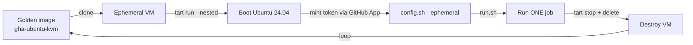

# macOS GitHub Actions Runner Setup

This repo automates GitHub Actions runner setup on macOS (Apple Silicon). It supports **two types** of runner that can run side by side. The key difference is the **capability** each one offers a job — what it can do, and whether it is isolated from the host. Both clean up after every job:

1. **macOS / AVF runners** — jobs run on macOS itself, which exposes Apple's **Virtualization.framework (AVF)** to the job. Jobs are **not isolated from the host**: although we wipe each runner's `_work` directory after every job, anything a job writes outside `_work` (Homebrew packages, global caches, `/tmp`, login items, keychains, etc.) persists and is visible to later jobs and to the machine.
2. **Ubuntu / KVM runners** — jobs run inside a throwaway Ubuntu 24.04 VM (via [Tart](https://tart.run)) which exposes **nested KVM** to the job. The VM is destroyed after a single job, so every job gets a clean environment that is **fully isolated from the host**, and workloads that need `/dev/kvm` (e.g. nested virtualization) just work. See [Ubuntu / KVM Runners](#ubuntu--kvm-runners).

> **Why two types? AVF vs KVM.** What we'd *ideally* want is isolated guest
> VMs for both worlds: a **macOS guest exposing AVF** and a **Linux guest
> exposing KVM**, so every job is sandboxed regardless of which virtualization
> stack it needs. We can't have that — because Apple only exposes the hardware
> virtualization extensions to **Linux** guests (nested virt is M3/M4 + macOS
> 15+, **Linux guests only**). A virtualized **macOS** guest gets *no* virt
> extensions, so it can't expose AVF. There's no isolated-VM option for the
> AVF/macOS side, so we have to **compromise there**:
>
> - **AVF (macOS):** since AVF can't be exposed inside a guest, the job runs on
>   the **macOS host** → **macOS / AVF runners**, with **no host
>   isolation.** (This is the compromise.)
> - **KVM (Linux):** the job runs inside an isolated Linux VM that *is* handed
>   hardware virtualization → **Ubuntu / KVM runners** (arm64 Linux guests
>   only), **fully isolated from the host**.

## Requirements

- **Apple Silicon only.** This repo targets arm64 Macs (M-series); Intel/x64 is
  not supported.
- **macOS:** the macOS / AVF runners run on any reasonably current macOS. The
  Ubuntu / KVM runners need **macOS 15 (Sequoia)+ on M3/M4** — see that
  section's [Requirements](#requirements).
- The Mac must reach GitHub over outbound HTTPS on port 443.

Reference docs:
- https://docs.github.com/en/actions/hosting-your-own-runners/managing-self-hosted-runners/adding-self-hosted-runners
- https://docs.github.com/en/actions/reference/runners/self-hosted-runners
- https://docs.github.com/en/actions/hosting-your-own-runners/managing-self-hosted-runners/removing-self-hosted-runners

---

# macOS / AVF Runners

The GitHub Actions agent runs directly on macOS, so jobs get access to Apple's
Virtualization.framework (AVF). These runners are **persistent** and **not
isolated from the host** (see the trade-off note at the top).

These runners:
- download and extract the GitHub runner package
- create numbered runner directories from a prefix
- configure each runner against a repo or org
- run them under launchd with restart behavior
- clean each runner work directory after every job (this clears `_work` only — it does **not** isolate jobs from the rest of the host)

## Scripts

- `bootstrap-gh-runners.sh`: creates directories, downloads runner binaries, extracts, and runs `config.sh` in unattended mode.
- `github-runner-wrapper.sh`: crash-recovery wrapper around `run.sh` (restart-on-crash, graceful SIGTERM, keeps the Mac awake).
- `github-runner-cleanup.sh`: canonical post-job cleanup hook; copied into each runner directory and wired up via `ACTIONS_RUNNER_HOOK_JOB_COMPLETED` to wipe `_work` after every job.
- launchd plists are generated automatically by bootstrap when using `--install-launchd`.

## 1) Get Setup Values from GitHub UI

In your repository or organization:
1. Go to Settings -> Actions -> Runners.
2. Click New self-hosted runner.
3. Select macOS and the correct architecture for your Mac.
4. Copy the URL target and registration token shown by GitHub.

Important:
- Do not commit tokens to git.
- If a token expires, generate a new one and rerun bootstrap.

## 2) One Command: Bootstrap + Hook Env + launchd

Organization example:

```bash
bash bootstrap-gh-runners.sh \
  --dir-prefix "$HOME/github-runner" \
  --count 2 \
  --org your-org \
  --token "YOUR_REGISTRATION_TOKEN" \
  --labels "self-hosted,macos,arm64" \
  --replace \
  --install-launchd
```

Repository example:

```bash
bash bootstrap-gh-runners.sh \
  --dir-prefix "$HOME/github-runner" \
  --count 2 \
  --repo owner/repo \
  --token "YOUR_REGISTRATION_TOKEN" \
  --labels "self-hosted,macos,arm64" \
  --replace \
  --install-launchd
```

What this creates:
- $HOME/github-runner-1
- $HOME/github-runner-2

Common flags:
- --runner-group <name>: Org or enterprise runner group.
- --name-prefix <prefix>: Base name for runners.
- --token-file <path>: Read the registration token from a file instead of `--token` (keeps the secret out of shell history and the process list).
- --force-recreate: Deletes existing directories before reinstall.
- --install-launchd: Installs/reloads launchd services for all runners 1..N.
- --launchd-label-prefix <prefix>: Custom launchd label prefix (default: com.github.runner).
- --launch-agents-dir <dir>: Custom LaunchAgents directory (default: ~/Library/LaunchAgents).
- --version x.y.z: Pins runner version instead of latest.

Incremental behavior:
- If prefix-1 and prefix-2 already exist and are configured, and you run with --count 4, the script skips 1/2 and sets up 3/4.
- It also ensures ACTIONS_RUNNER_HOOK_JOB_COMPLETED is present in each runner .env and writes job-completed-hook.sh.
- With --install-launchd, it installs/reloads services com.github.runner-1 .. com.github.runner-4.

## 3) Verify

```bash
launchctl list com.github.runner-1
launchctl list com.github.runner-2
```

If you used count 4, also check:

```bash
launchctl list com.github.runner-3
launchctl list com.github.runner-4
```

Expected in runner terminal/logs after startup:
- Connected to GitHub
- Listening for Jobs

## Logs

```bash
tail -f ~/.github-runner-logs/runner-1-*.log
tail -f ~/.github-runner-logs/runner-2-*.log
tail -f ~/github-runner-1/.cleanup.log
tail -f ~/github-runner-2/.cleanup.log
```

## Restart / Stop / Uninstall

Restart runners (example for 1..4):

```bash
for i in 1 2 3 4; do
  launchctl unload ~/Library/LaunchAgents/com.github.runner-${i}.plist || true
done
for i in 1 2 3 4; do
  launchctl load ~/Library/LaunchAgents/com.github.runner-${i}.plist
done
```

Remove launchd services for arbitrary 1..N (example for 1..4):

```bash
for i in 1 2 3 4; do
  launchctl unload ~/Library/LaunchAgents/com.github.runner-${i}.plist || true
  rm -f ~/Library/LaunchAgents/com.github.runner-${i}.plist
done
```

Remove runner registration from GitHub:
- Use the Remove flow in GitHub Settings -> Actions -> Runners for each runner.
- If you still have machine access, use the remove command GitHub provides in that UI.

---

# Ubuntu / KVM Runners

These runners run every CI job inside a **single-use Ubuntu 24.04 VM** managed by
[Tart](https://tart.run). When a job finishes, the VM is destroyed and the next
job gets a fresh clone of a golden image. Because the guests boot with nested
virtualization enabled, `/dev/kvm` is available inside the job — ideal for
workloads that themselves spin up VMs.

These runners are **additive**: they register as separate runners and coexist
with the macOS / AVF runners above.

## Scripts

- `bootstrap-tart-runners.sh`: bakes the golden image (if needed) and installs one launchd service per runner.
- `tart-bake-ubuntu.sh`: builds the golden Ubuntu 24.04 image with the runner + KVM pre-installed.
- `tart-runner-loop.sh`: endless single-use ephemeral runner loop (clone → run one job → destroy).
- `tart-github-app-token.sh`: mints short-lived runner registration tokens from a GitHub App.
- `tart-common.sh`: shared helpers/defaults sourced by the above (not run directly).

## How it works



One `tart-runner-loop.sh` process == one concurrent runner. `bootstrap-tart-runners.sh`
launches N of them under launchd.

## Requirements

- **Hardware/OS:** Apple Silicon **M3 or M4** running **macOS 15 (Sequoia) or
  later**. Nested virtualization is gated to this combination and to **Linux
  guests only** — see the [Tart FAQ](https://tart.run/faq/#nested-virtualization-support).
  The inner KVM is arm64-only (no x86 guests).
- **Host tooling:** [`tart`](https://tart.run), `curl`, `openssl`, `jq`,
  `sshpass` (used once during the bake), and `ssh`/`ssh-keygen`.

  ```bash
  brew install cirruslabs/cli/tart jq
  brew install hudochenkov/sshpass/sshpass   # or any sshpass formula
  ```

- A **GitHub App** for token minting (see below). We deliberately avoid
  long-lived PATs and never store a registration token on disk.

## 1) Create the GitHub App

The runners authenticate as a GitHub App. The host holds only the App's private
key; each VM boot mints a fresh, short-lived registration token.

1. Go to **GitHub → Settings**:
   - For a **repository/personal** target: your user **Settings → Developer
     settings → GitHub Apps → New GitHub App**.
   - For an **organization** target: **Org Settings → Developer settings →
     GitHub Apps → New GitHub App** (so the org owns the App).
2. Fill in:
   - **GitHub App name:** anything unique, e.g. `my-tart-runners`.
   - **Homepage URL:** anything (e.g. your repo URL).
   - **Webhook:** untick **Active** (we don't need webhooks).
3. Set **Permissions**:
   - **Repository target:** Repository permissions → **Administration: Read &
     write** (required to create runner registration tokens).
   - **Organization target:** Organization permissions → **Self-hosted runners:
     Read & write**.
4. Under **Where can this GitHub App be installed?** choose **Only on this
   account**.
5. Click **Create GitHub App**.
6. On the App's page, note the **App ID** (top of the page).
7. Scroll to **Private keys → Generate a private key**. This downloads a
   `.pem` file. **Store it securely** (e.g. `~/.config/github-runner-tart/app.private-key.pem`,
   `chmod 600`). Never commit it.
8. Click **Install App** (left sidebar) → install it on the account, and select
   the repository (or **All repositories**) / organization you want runners for.

You now have an **App ID** and a **private key `.pem`** — that's all the host
needs.

## 2) Bake the golden image (first run, ~once)

`bootstrap-tart-runners.sh` does this automatically on first run, but you can do
it explicitly:

```bash
bash tart-bake-ubuntu.sh
# options: --golden-image <name> --base-image <ref> --runner-version <x.y.z> --force
```

This:
- generates a dedicated SSH keypair at `~/.config/github-runner-tart/id_ed25519`
  (reused on subsequent bakes),
- clones `ghcr.io/cirruslabs/ubuntu:latest` (Ubuntu 24.04) into `gha-ubuntu-kvm`,
- boots it with `--nested`, injects the key, installs the Actions runner and its
  dependencies, **verifies `/dev/kvm` with `kvm-ok`** (the bake fails if nested
  KVM is unavailable), then disables password SSH and shuts down.

> Note: the cirruslabs base image ships with well-known `admin`/`admin`
> credentials. They are used **only once** during the bake to inject our key;
> password authentication is then turned off inside the golden image.

## 3) One command: bootstrap + launchd

Repository target:

```bash
bash bootstrap-tart-runners.sh \
  --count 2 \
  --repo owner/repo \
  --app-id 123456 \
  --private-key "$HOME/.config/github-runner-tart/app.private-key.pem" \
  --install-launchd
```

Organization target:

```bash
bash bootstrap-tart-runners.sh \
  --count 4 \
  --org your-org \
  --app-id 123456 \
  --private-key "$HOME/.config/github-runner-tart/app.private-key.pem" \
  --install-launchd
```

Default labels are `arm64,kvm,linux,ubuntu-24.04` (GitHub adds `self-hosted`
automatically). These runners are intentionally tagged for ARM64/KVM jobs only;
make the workflow request those labels explicitly, not generic Linux-only labels:

```yaml
jobs:
  build:
    runs-on: [self-hosted, arm64, kvm, linux, ubuntu-24.04]
```

If you omit `arm64` or `kvm`, GitHub may route the job to a different runner.

Common flags:
- `--count <N>`: number of concurrent ephemeral runners.
- `--golden-image <name>`: golden image name (default `gha-ubuntu-kvm`).
- `--base-image <ref>`: base OCI image (default `ghcr.io/cirruslabs/ubuntu:latest`).
- `--runner-version <x.y.z>`: pin the Actions runner version baked in.
- `--labels <csv>`: override runner labels.
- `--name-prefix <prefix>`: runner name prefix (default `tart-ubuntu`).
- `--rebuild-image`: force a rebuild of the golden image.
- `--install-launchd`: install/reload a launchd service per runner.
- `--launchd-label-prefix <p>`: launchd label prefix (default `com.github.tart-runner`).

## 4) Verify

```bash
launchctl list com.github.tart-runner-1
launchctl list com.github.tart-runner-2
tail -f ~/.github-runner-logs/tart-runner-1-*.log
```

You should see clone → boot → "Listening for Jobs" → teardown on each cycle. In
**GitHub → Settings → Actions → Runners** you'll see ephemeral runners appear
for the duration of a job and disappear afterwards.

## 5) Run a loop manually (no launchd)

Useful for debugging:

```bash
bash tart-runner-loop.sh \
  --app-id 123456 \
  --private-key "$HOME/.config/github-runner-tart/app.private-key.pem" \
  --repo owner/repo \
  --golden-image gha-ubuntu-kvm \
  --index 1
```

## Restart / Stop / Uninstall (Ubuntu / KVM runners)

```bash
# Restart runners 1..N (example 1..2)
for i in 1 2; do
  launchctl unload ~/Library/LaunchAgents/com.github.tart-runner-${i}.plist || true
  launchctl load   ~/Library/LaunchAgents/com.github.tart-runner-${i}.plist
done

# Remove services 1..N
for i in 1 2; do
  launchctl unload ~/Library/LaunchAgents/com.github.tart-runner-${i}.plist || true
  rm -f ~/Library/LaunchAgents/com.github.tart-runner-${i}.plist
done

# Remove the golden image entirely
tart delete gha-ubuntu-kvm
```

Ephemeral runners deregister themselves automatically (they are configured with
`--ephemeral`), so there's normally nothing to clean up in the GitHub UI.

## Troubleshooting

- **`/dev/kvm` missing / bake fails at `kvm-ok`:** the host isn't M3/M4 on
  macOS 15+, or Tart was started without `--nested`. Nested virt is not
  supported on M1/M2.
- **Token minting fails:** check the App ID, that the `.pem` matches the App,
  that the App is **installed** on the target repo/org, and that it has the
  Administration / Self-hosted runners write permission.
- **Guest never gets an IP / SSH:** raise `TART_BOOT_TIMEOUT`; confirm the base
  image pulled correctly with `tart list`.

---

**Questions?** Check the logs in `~/.github-runner-logs/` — they're usually the source of truth.
